# 缺失感知行人轨迹预测模型构建与实验验证方案

_工程与研究执行方案 · 基于当前 DeMo actor-only 基线 · 更新日期 2026-09-08_

> **方法层改版同步（2026-09-08）**：M1–M4 方法层已按"证据中心预测"框架重构为 M1'/M2'/M3'/M4'（证据时钟解码 / 社会证据补偿 / 证据校准 / 缺失增广训练），权威定义见《[选题](../research/选题.md)》§1.2 误差结构分解与 §五.0A 方法框架（2026-09-08 已与原《选题（改）》合并为唯一选题文档）。本方案 §2.3/§2.4/§2.5 中的旧 `M1_obs`–`M4_full` 开关矩阵、§5 的 v1/v2/v3 筛选矩阵属于**已实现并完成首筛的历史工程路线**，保留作为输入特征工程路线的对照证据与代码资产；新的 M1'–M4' 实现任务、验收标准与实验矩阵将另行增补（增补前不得启动新方法层正式实验）。数据协议（Easy/Hard-direct=TrajImpute release；Clean-direct=原始完整 ETH/UCY 重训指标，暂定 M0-uni 0.232/0.389；自建 benchmark_v1 数据 2026-09-13 作废）与全部验收门槛按新口径执行。
>
> **状态（2026-09-13 更正）：自建 `ETHUCY_benchmark_v1` 与 Clean-direct runner 已作废删除**（重切窗口偏离经典 LOO 预定义划分）。Clean-direct = 本文模型在原始完整 ETH/UCY（经典 LOO）上重训+测试（现有 M0-current 单向 0.232/0.389）。作废的仅是自建 benchmark_v1 数据版本。正式协议 = Clean-direct（原始数据重训）+ Easy/Hard-direct（TrajImpute 官方 release）。官方 `Clean/Easy-impute/Hard-impute` 为插补后预测参考协议，仅作有限范围外部对照。本文档中历史 v1/v2/v3 数据协议、条件矩阵与实验设计降级为“历史预实验协议与归档说明”（见 §1.5）。**K 口径裁定（2026-09-08）：主链 K=20**（num_modes=20，与 TrajImpute 官方预测协议对齐；历史 K=6 口径不再使用）——本文档 §4/§5 旧任务清单中的 num_modes=6、val_minFDE6 等配置为历史工程记录，重启正式实验前须按 K=20 更新配置与 monitor 指标名。
>
> **面向执行者：** 本文定义缺失感知模型的最小可验证版本、实现边界、实验矩阵、统计口径和验收条件。所有新增方法必须以冻结的训练/评估协议为基础，不能用测试集选择模块、超参数或 checkpoint。

## 实施状态（2026-09-07 审核后更新）

- 任务 1：完成（`src/datamodule/missing_features.py` + 14 项单测）
- 任务 2：完成（ETH/UCY benchmark 与 SDD missing 数据接口 + collate + 测试）
- 任务 3 的 M1/M2：完成（`use_observation_features` / `use_missing_summary` 历史编码开关；TimeDecoder 未动）
- 任务 4：完成（`conf/model/missing_aware_*.yaml` × 2 + `conf/config_missing_aware_*.yaml` × 2 + 配置测试）
- TrajImpute 适配任务：完成（30 个 release pkl 全部完成适配扫描；直接预测评估器、M0/M1/M2 模型链路和分组评估均已验收）
- 既有回归：通过（项目指定环境下 TrajImpute 新增测试 26 项、既有缺失感知回归 37 项；合并运行共 63 项通过）
- 运行环境：正式验收必须使用 `PYTHONNOUSERSITE=1` 和 `/home/lbh/.conda/envs/DeMo/bin/python`，避免默认 Python 3.13 错误加载用户级 `mamba_ssm` CUDA 扩展
- M3/M4（State/Mode Query、Hybrid Coupling 条件化）：未开始
- 正式主实验：Easy/Hard-direct 主链运行中；Clean 自建数据（benchmark_v1）作废（2026-09-13），Clean 口径=原始 ETH/UCY 重训指标

**目标：** 在现有 DeMo actor-only 模型上构建“观测过程条件化”的缺失感知模型，使历史掩码、观测间隔和有效运动片段不仅参与历史编码，也可以条件化 Mode Query、State Query 与 Hybrid Coupling；通过逐级消融验证其在高缺失历史行人轨迹预测上的独立价值。

**架构：** 数据读取层根据现有 `history_mask` 生成时间步观测特征与历史级缺失摘要；模型以一个配置开关在当前 DeMo 基线、仅历史编码条件化、查询条件化和 Hybrid Coupling 条件化之间切换。实验按“训练适配、零样本鲁棒性、混合条件泛化”三种口径独立报告，主结论只来自预先指定的同骨干配对实验。

**技术栈：** Python、PyTorch、PyTorch Lightning、Hydra、TorchMetrics、Mamba、现有 ETH/UCY 与 SDD 数据管线、pytest、JSON/CSV/Markdown。

---

## 1. 背景、证据与决策边界

### 1.1 已有事实

当前仓库已经具备可进入模型原型阶段的基础：

- （已删除，2026-09-13）历史 `data/ETHUCY_missing_v1/`、`data/SDD_missing_v1/` 曾提供 12.5% 随机单帧 / 25% 连续双帧轻度缺失条件。
- （已删除，2026-09-13）历史 `data/ETHUCY_missing_v2_high/`、`data/SDD_missing_v3_noguard/` 等曾提供 37.5%~75% 高缺失条件；正式缺失数据现统一为 TrajImpute 官方 Easy/Hard release。
- v2_high 数据已完成结构、掩码、未来一致性、泄漏和模型接口审计（0 失败；审计文档 2026-09-13 随历史协议废弃删除）。
- ETH/UCY 训练适配结果中，单向与双向历史 Mamba 在各条件下的差异没有稳定性，不能把“选双向”作为方法主张。
- ETH/UCY 零样本高缺失结果中，完整历史训练的双向模型比单向模型更稳，五个高缺失条件的 `minFDE6` 平均相对变化为 -22% 至 -44%；这说明高缺失场景存在真实的模型脆弱性和可改进空间，但不能替代缺失感知方法本身的对照实验。
- SDD 的单种子训练适配结果中，单向模型在 `random_fixed3` 与 `random_block6` 出现早期选点和明显退化；这可能是结构差异，也可能是优化不稳，不能直接写成方法结论。

### 1.2 当前模型的缺口

当前 `ModelForecast` 把 `x_positions_diff`、`x_velocity_diff` 与每步 `x_valid_mask` 拼接成 4 维历史输入。它已经避免把无效差分直接当作运动，但缺少以下信息：

- 缺失持续多久，即当前时刻距最近一次有效观测的时间间隔；
- 当前有效运动证据来自多长的连续可见片段；
- 整段历史的缺失率、最长连续缺口和最近有效运动步数量；
- 历史缺失条件对 Mode Query、State Query 与 Hybrid Coupling 的显式调制。

当前基础模型的主要接口位置如下：

| 组件 | 当前职责 | 缺失感知改动位置 |
|---|---|---|
| `src/datamodule/ethucy_benchmark_dataset.py` | 从 `.pt` 样本生成历史位置、差分、速度差和 mask | 生成 `x_observation_features` 与 `x_missing_summary` |
| `src/datamodule/sdd_missing_dataset.py` | 从 SDD missing 样本生成同构字段 | 使用与 ETH/UCY 完全相同的观测特征语义 |
| `src/model/model_forecast.py` | 编码 actor 历史、社会上下文并调用解码器 | 将历史输入维度配置化；生成并传递历史级缺失条件 |
| `src/model/layers/time_decoder.py` | 生成 State Query、Mode Query 和 Hybrid 表征 | 对 Query 初始化与 Hybrid 表征应用缺失条件调制 |
| `src/model/trainer_forecast.py` | 训练、验证、测试和现有主指标 | 维持当前损失；新增可选诊断指标与结果记录 |

### 1.4 TrajImpute 数据适配方案（release、适配器与直接预测评估已验收）

正式实验改用 TrajImpute 官方数据（arXiv:2411.00174；仓库 `github.com/Pranav-chib/TrajImpute`）。数据层面不需要自建 v1/v2/v3 缺失生成方案，适配工作分为两层：

**A. 官方数据复现层**

- 读取 TrajImpute 官方原始 train/test/val 三个 pkl；
- 按官方 `generate_data.py` 生成缺失样本，或读取官方 release 已提供的缺失样本并复核一致性；
- 记录 release 来源、脚本版本、随机种子与 manifest。
- **release 状态（2026-09-07）**：官方 release 已下载至 `~/TrajImpute/dataset/TrajImpute/`（5 场景 × Easy/Hard × 3 split 共 30 个 pkl，约 238 MB）并完成数据完整性审计（字段/shape、NaN=mask 一致性、未来完整、Easy 0–4 帧近均匀、Hard 恰 4–7 帧、test 块结构 0–4/4–7、缺失位置 C(8,k) 全组合、每样本 ≥1 有效帧、跨 split 无 GT 重叠；30/30 通过）。审计记录见《选题》§八.0.2。正式实验直接采用发布 pkl，不重新运行 `generate_data.py`。
- **脚本核验（逐行）**：`generate_data.py` 对每轨迹从 {0,1,2,3,4} 均匀采样缺失帧数、`np.random.choice(8, k, replace=False)` 散布缺失位置、缺失值置 `np.nan`；test 按每个缺失数复制 5 份；输出新增 `missing_mask`、`obs_traj_rel`。脚本只实现 0–4 帧缺失，不含 Hard 生成逻辑；**Hard 数据为官方生成后直接发布**（release 实测每轨迹缺失恰为 4–7 帧之一，均值约 68.7%）。
- **专项复现风险与 release 裁定**：脚本文本存在 L69 `test_missing_indices` 与 L71 残留变量 `missing_indices` 不一致的缺陷；**对发布数据实测未生效**（test 各块缺失位置逐轨迹变化且覆盖全部 C(8,k) 组合，见《选题》§八.0.2）。裁定：正式实验以发布 pkl 为准；若复现需重跑生成逻辑，须先建立本地修正补丁并单独记录差异，分别报告"官方脚本输出"与"修正版脚本输出"。

**B. DeMo 直接预测适配层**

- 将原始样本转换为当前 `EthUcyBenchmarkDataset` 所需的 actor-centric 字段；
- 派生 `x_valid_mask`（由官方 missing mask 直接派生，缺失=0、可见=1，不得从占位坐标推断）、时间间隔、有效运动片段与末端锚点；
- **不经过默认外部插补器**——官方“插补后预测”流程不是本文主流程，仅作为外部对照。

**语义规则（沿用已验证的数据安全原则，并按当前 release 重新落地）**

1. 未来轨迹保持官方原样的监督目标，不做任何填充或恢复；
2. 缺失位置的数值（NaN）不得参与坐标变换、差分、速度计算或位置嵌入——所有运动学量只由可见帧计算；
3. 速度/位移使用“前一个有效观测”及其时间间隔，而不是只使用相邻帧；
4. 末端历史帧缺失时：以最后有效位置为参考位置、最近有效运动方向为参考朝向，并显式记录 forecast gap；本文 direct 评估器采用该适配器输出，不将其表述为 TrajImpute 官方原生 evaluator。官方论文/外部代码的聚合细节仍单独保留为外部参考核验项。

**数据审计结果（2026-09-07 已执行，30/30 文件通过；记录见《选题》§八.0.2）**

- [x] 检查 `obs_traj`、`pred_traj`、`missing_mask` 的实际字段和 shape（8 键；`[N,8,2]`/`[N,12,2]`/bool `[N,8,2]`）；
- [x] 检查缺失坐标是否为 NaN（是；NaN 计数与 mask.sum() 严格相等）；
- [x] 检查 `missing_mask` 的 True/False 语义（True=缺失）；
- [x] 检查历史长度是否为 8、未来长度是否为 12（是）；
- [x] 检查未来坐标是否完整（pred_traj NaN=0）；
- [x] 检查 train/val/test 是否存在并且没有交叉泄漏（pred_traj 精确坐标两两无交集）；
- [x] 统计每个样本真实缺失帧数量；统计 Easy/Hard 的缺失帧分布（Easy 0–4 近均匀约 25%；Hard 恰 4–7 帧约 68.7%）；
- [x] 检查测试集按缺失数量扩展后的样本数（Easy=5 块 0–4、Hard=4 块 4–7，GT 跨块相同）；
- [x] 检查每个样本至少存在一个有效历史观测（最大缺失 ≤7，0 违规）；
- [x] 对全部 30 个 pkl 建立适配器并抽查每个 split 的首/中/末 focal 样本；所有浮点派生字段均为有限值。关键末端锚点、跨缺口运动特征、collate 与真实模型链路由 `tests/test_trajimpute_dataset.py`、`tests/test_trajimpute_metrics.py` 覆盖。

**当前状态（2026-09-07 审核后更新）**

```text
文档适配方案：已完成（本节约定）
官方数据 release：已下载并通过数据完整性审计（《选题》§八.0.2）
TrajImpute 适配器：已实现（`src/datamodule/trajimpute_dataset.py`）；30 个 pkl 的五场景、Easy/Hard、train/val/test 适配扫描均通过
直接预测评估器：已实现（`src/evaluation/trajimpute_direct.py` + `scripts/结果分析/evaluate_trajimpute_direct.py`）；人工样例和真实数据分组管线均通过
模型接口验收：项目指定环境中 26 项 TrajImpute 测试通过（M0 forward/backward、M1/M2 forward、真实数据分组评估均覆盖）；既有缺失感知回归 37 项通过
padding 修复：`target_mask` 的 actor padding 已从 `True` 修正为 `False`，并新增 1/3 actor 混合 batch 回归测试，确保 padding actor 不进入 `others_reg_loss`
最小运行验证：已通过（ETH-M/Easy，M0，2 个 train batch、checkpoint 加载、1 个 test batch 分组评估；仅工程 smoke，不构成实验结果）
运行环境：使用 `PYTHONNOUSERSITE=1 PYTHONPATH=. /home/lbh/.conda/envs/DeMo/bin/python`。默认 `/opt/miniconda3` Python 3.13 会错误加载用户级 `mamba_ssm` CUDA 扩展并触发 GLIBC 不兼容，不得用于验收或正式训练
（2026-09-13 作废）Clean-direct 数据源 `data/ETHUCY_benchmark_v1` 已删除；Clean 不再自建
Easy/Hard-direct 数据源：TrajImpute 官方 Easy/Hard release pkl；Easy 零缺失子集仅作诊断
正式主训练：尚未开始；数据源和入口已冻结
```

新增实现（2026-09-07）：`src/datamodule/trajimpute_dataset.py`（含官方 test pkl `seq_start_end` 列表重复缺陷的确定性修复——官方 `generate_data.py` 用列表乘法复制场景条目未加块偏移，适配器检测到重复模式后按块偏移重建，不修改官方文件）；`conf/config_missing_aware_trajimpute.yaml` + `conf/datamodule/trajimpute.yaml`；`scripts/训练与评估/run_missing_aware_trajimpute.py`（smoke runner）；测试 `tests/test_trajimpute_dataset.py` + `tests/test_trajimpute_metrics.py`（26 项，含 M0 forward/backward、M1/M2 forward、跨缺口速度、末端锚点、Easy/Hard 分组统计）。

（2026-09-13）Clean 不自行训练，参照直接引用原论文数字。

### 1.5 历史预实验协议与归档说明

`data/ETHUCY_missing_v1/`、`ETHUCY_missing_v2_high/`、`ETHUCY_missing_v3_noguard/`（及 SDD 对应目录）、`build_missing_history_dataset.py`、v1/v2 保护帧规则、v3 无保护锚点回退规则以及本文 §5 的 v1/v2/v3 条件矩阵、训练适配/零样本/混合条件实验设计，自 2026-09-07 起**归档为历史预实验**：

- 结果快照仍保留在 `outputs/`（复现溯源用）；缺失数据本体、构建脚本与失效入口已于 2026-09-13 删除，git 历史可溯；
- 不再作为论文正式主实验协议，其结果不构成 TrajImpute 官方结果，不与 Easy-direct/Hard-direct 主结果混合，不用于推导新 benchmark 的提升幅度；
- 统一说明：这些结果来自历史自定义 v3 无保护、train_adapt、单种子探索性实验；其价值是定位问题和指导设计，不构成 TrajImpute 官方结果，也不构成本文 TrajImpute-derived 直接预测主结论；
- 正式主协议见《选题》§八.0；本节所引 §5 实验设计在官方 release 审计与适配器完成前不执行。

### 1.3 本阶段能与不能回答的问题

本阶段要回答：

> 在相同数据、相同骨干、相同训练配方与相同 checkpoint 选择规则下，显式编码缺失结构并将其条件化到结构化未来分布中，是否比当前仅含有效性标量的 DeMo 基线更好？

本阶段不能直接回答：

- 双向 Mamba 是否在任何行人预测任务上优于单向 Mamba；
- 插补是否一定优于直接预测；
- 完整历史指标是否达到或超过外部方法；
- 末帧缺失、身份切换、检测噪声或地图输入下的鲁棒性；
- 模型内部 Mode/State 表示是否对应真实心理意图或物理状态。

## 2. 总体方法设计

### 2.1 方法名称与最小主张

暂定方法名为 **MCD-DeMo**（Missing-Conditioned Decoupled Motion Forecasting），中文表述为“观测缺失条件化的结构化多模态预测”。

第一版只主张三件事：

1. 通过观测掩码、时间间隔和有效运动证据构造缺失感知历史表征；
2. 将历史级缺失条件注入 DeMo 的跨候选差异、轨迹内时序演化或二者的联合表征；
3. 在高缺失和连续缺失下，以不牺牲完整历史性能为前提改善预测、覆盖或连续性中的至少一项。

不在第一版中加入独立插补器、教师蒸馏、地图分支、额外生成器、扩散模型或辅助重建损失。它们会扩大变量数量，削弱因果归因。

### 2.2 模型数据流

```mermaid
flowchart LR
    accTitle: Missing-conditioned DeMo flow
    accDescr: The flow shows how observed trajectory fragments and missingness metadata create a history condition that is injected into the DeMo encoder and structured decoder.

    observed_history[(📥 Missing history)]
    feature_builder[⚙️ Build observation features]
    history_encoder[🧠 Encode actor history]
    social_encoder[🧠 Encode social context]
    missing_summary[📊 Pool missing condition]
    state_query[⚙️ Condition State Query]
    mode_query[⚙️ Condition Mode Query]
    hybrid_coupling[⚙️ Condition Hybrid Coupling]
    forecast[📤 Multi-modal future]

    observed_history --> feature_builder
    feature_builder --> history_encoder
    history_encoder --> social_encoder
    feature_builder --> missing_summary
    social_encoder --> state_query
    social_encoder --> mode_query
    missing_summary --> state_query
    missing_summary --> mode_query
    state_query --> hybrid_coupling
    mode_query --> hybrid_coupling
    missing_summary --> hybrid_coupling
    hybrid_coupling --> forecast

    classDef primary fill:#dbeafe,stroke:#2563eb,stroke-width:2px,color:#1e3a5f
    classDef accent fill:#ede9fe,stroke:#7c3aed,stroke-width:2px,color:#3b0764
    classDef output fill:#dcfce7,stroke:#16a34a,stroke-width:2px,color:#14532d

    class feature_builder,history_encoder,social_encoder primary
    class missing_summary,state_query,mode_query,hybrid_coupling accent
    class forecast output
```



### 2.3 时间步观测特征

对每个真实 actor 的历史窗口 `t = 0..7`，统一构造下列量：

| 字段 | 形状 | 定义 | 语义与边界 |
|---|---:|---|---|
| `x_valid_mask` | `[A, 8]` | 当前帧是否可见 | 已存在，保持不变 |
| `x_gap_steps` | `[A, 8]` | 距最近有效观测的离散步数 | 当前帧有效时为 `0`；开头连续缺失用 `t + 1` 表示“窗口内未见过有效帧” |
| `x_prev_valid_gap` | `[A, 8]` | 当前有效帧距前一有效帧的步数 | 当前帧无效为 `0`；首个有效帧为 `0` |
| `x_motion_valid` | `[A, 8]` | 当前位移步是否由相邻有效帧构成 | `t=0` 为 `False`；其余等于 `history_mask[t-1] & history_mask[t]` |
| `x_motion_run` | `[A, 8]` | 当前时刻结尾的连续有效位移步长度 | 当前步无效为 `0`；有效时连续计数，从 `1` 开始 |
| `x_positions_diff` | `[A, 8, 2]` | 局部坐标相邻差分 | 无效运动步为 `0`，已存在 |
| `x_velocity_diff` | `[A, 8]` | 相邻速度差 | 需要两步有效运动证据，否则为 `0`，已存在 |

其中时间间隔不应读取未来信息，也不应根据未来帧反推最后观测。历史 v1/v2 协议曾固定帧 6、7 可见，但该约束不适用于当前 TrajImpute release；当前适配器按官方 `missing_mask`、最后有效观测和显式 `forecast_gap` 执行。

### 2.4 历史级缺失摘要

对每个 actor 生成 `x_missing_summary[A, 6]`，并在模型中投影到 `embed_dim`：

```text
missing_rate       = mean(1 - x_valid_mask)
longest_gap_norm   = max consecutive missing frames / obs_len
missing_prefix     = number of missing frames before first valid frame / obs_len
valid_motion_rate  = mean(x_motion_valid[1:])
last_motion_run    = x_motion_run[-1] / (obs_len - 1)
gap_area_norm      = sum(x_gap_steps) / (obs_len * obs_len)
```

`x_missing_summary` 仅使用观测 mask 派生，不使用位置、未来轨迹、标签、场景名、fold 或条件名。因此同一真实样本在相同掩码下必然生成完全一致的摘要；数据制作阶段的 `condition` 字符串不得进入模型输入。

### 2.5 三个可开关模块

为保证消融可解释性，采用一个 `missing_conditioning` 配置而不是复制多份模型类：

| 开关 | 默认值 | 作用 |
|---|---:|---|
| `use_observation_features` | `false` | 将 `x_gap_steps`、`x_prev_valid_gap`、`x_motion_valid`、`x_motion_run` 加入 actor 历史 MLP |
| `use_missing_summary` | `false` | 将 `x_missing_summary` 投影为 actor 条件向量并加到历史 actor token |
| `condition_state_query` | `false` | 将 focal actor 的缺失条件加到全部 State Query |
| `condition_mode_query` | `false` | 将 focal actor 的缺失条件加到全部 Mode Query |
| `condition_hybrid` | `false` | 以门控方式调制 Hybrid Coupling 表征 |

开关的预设组合如下：

| 实验标签 | `use_observation_features` | `use_missing_summary` | State | Mode | Hybrid | 研究问题 |
|---|---:|---:|---:|---:|---:|---|
| `M0_base` | false | false | false | false | false | 当前 DeMo 缺失历史基线 |
| `M1_obs` | true | false | false | false | false | 时间间隔与有效运动片段是否有价值 |
| `M2_history` | true | true | false | false | false | 历史级缺失摘要是否改善上下文 |
| `M3_query` | true | true | true | true | false | 缺失条件是否应进入 Mode/State Query |
| `M4_full` | true | true | true | true | true | Hybrid Coupling 的额外价值 |

`M0_base` 必须保留原有输入维度与数值路径；不允许因实现重构而改变其输出。完整历史样本下，`M1_obs` 到 `M4_full` 的新增缺失特征均应为可预测的中性值：`x_gap_steps=0`、`x_prev_valid_gap=1`（首帧为 `0`）、`x_motion_valid[t>=1]=true`、`x_motion_run=[0,1,...,7]`、`missing_summary=[0,0,0,1,1,0]`。这使“完整历史不退化”可被直接检验。

### 2.6 条件化机制

令 `r_i = MissingSummaryEmbed(x_missing_summary_i)` 为 actor `i` 的唯一缺失条件向量，`r_f = r_0` 为 focal actor 条件。`r_i` 必须由同一个摘要编码器生成，同时服务历史 actor token 与解码器；不能分别学习两套摘要表征。所有后续投影都使用 `embed_dim=128`，并初始化为接近零增量，避免刚加入模块时破坏原有训练动态。

历史 actor token：

```text
h_i = HistoryEncoder(z_i) + TypeEmbedding_i + r_i
```

State Query：

```text
s_t = TimeEmbedding(t) + W_state(r_f)
```

Mode Query：

```text
m_k = FocalContext + ModeEmbedding(k) + W_mode(r_f)
```

Hybrid Coupling：

```text
g_f = sigmoid(W_gate(r_f))
q_k,t = BaseHybrid(m_k, s_t, H) + g_f ⊙ W_hybrid(r_f)
```

不将 `r_f` 直接拼接到预测头的原始输出坐标，也不手工规定“缺失越多尺度越大”。概率 `pi`、轨迹位置和 Laplace scale 是否改变，应由端到端训练决定。

## 3. 文件结构与实现边界

> **历史工程记录（2026-09-13 注）**：本节及 §4/§5 所列 `ethucy_benchmark_*`、`sdd_missing_*`、`missing_aware_sdd`、`run_missing_aware_*`、`analyze_missing_aware` 等文件属旧自定义缺失协议工程路线，已随旧数据一并删除（git 历史可溯）；现行主链文件为 `trajimpute_dataset.py`、`config_missing_aware_trajimpute` 与 `run_trajimpute_experiments.py`。下文保留原文仅作执行记录。

### 3.1 新增或修改的文件

| 路径 | 变更 | 职责 |
|---|---|---|
| `src/datamodule/missing_features.py` | 新增 | 纯函数：由 `history_mask` 构造时间步观测特征与历史级摘要 |
| `src/datamodule/ethucy_benchmark_dataset.py` | 修改 | 在现有样本输出中加入 `x_gap_steps`、`x_prev_valid_gap`、`x_motion_valid`、`x_motion_run`、`x_missing_summary` |
| `src/datamodule/sdd_missing_dataset.py` | 修改 | 生成与 ETH/UCY 同语义的新字段 |
| `src/datamodule/ethucy_benchmark_dataset.py` 的 collate | 修改 | 对新增 actor 维字段进行 padding；保持 padding actor 的 mask 为 `False` |
| `src/datamodule/moflow_ethucy_dataset.py` 的 collate | 修改 | 为 SDD missing 路径 collate 新字段 |
| `src/model/model_forecast.py` | 修改 | 配置化历史特征维度、缺失摘要编码和解码器参数传递 |
| `src/model/layers/time_decoder.py` | 修改 | 接收 focal 缺失条件并对 State/Mode/Hybrid 分支应用开关控制的调制 |
| `conf/model/missing_aware_ethucy_model_forecast.yaml` | 新增 | ETH/UCY `M0` 至 `M4` 的模型参数模板，`num_modes=6` |
| `conf/model/missing_aware_sdd_model_forecast.yaml` | 新增 | SDD `M0` 至 `M4` 的模型参数模板，`num_modes=20` |
| `conf/config_missing_aware_ethucy.yaml` | 新增 | ETH/UCY 主实验配置，监控 `val_minFDE6` |
| `conf/config_missing_aware_sdd.yaml` | 新增 | SDD 主实验配置，监控 `val_minFDE20` |
| `tests/test_missing_features.py` | 新增 | 时间间隔、连续可见运动、摘要值和边界条件的单位测试 |
| `tests/test_missing_aware_dataset.py` | 新增 | 两个数据集的新字段、collate padding 与 v1/v2 语义测试 |
| `tests/test_missing_aware_model.py` | 新增 | 五种开关组合前向、完整历史中性值、单 actor、多 actor 与无 NaN/Inf 测试 |
| `scripts/训练与评估/run_missing_aware_ethucy.py` | 新增 | ETH/UCY 五折训练、验证选点、held-out test、结果汇总 |
| `scripts/训练与评估/run_missing_aware_sdd.py` | 新增 | SDD 条件训练、验证选点、held-out test、结构化摘要输出 |
| `scripts/结果分析/analyze_missing_aware.py` | 新增 | 配对统计、置信区间、曲线数据和 Markdown 表格生成 |
| `docs/results/缺失感知模型实验汇总.md` | 新增 | 方法实验的唯一权威汇总，不覆盖既有基线汇总 |

### 3.2 不修改的内容

- 历史缺失数据目录已删除（2026-09-13）；正式缺失数据统一读取 TrajImpute 官方 release，不再自建。
- 不改变当前的 `obs_len=8`、`pred_len=12` 与未来标签完整、坐标局部化方式和数据划分（此条为历史 v1/v2 数据口径；TrajImpute 适配后以其官方口径为准）。
- 不修改现有 `M0` 的训练超参数作为获得方法收益的手段。
- 不用测试集选择 epoch、学习率、dropout、隐藏维度、门控位置或随机种子。
- 不在当前方法阶段将 `M0` 与外部 MoFlow 结果混在同一张主表。

## 4. 分阶段实现任务

### 任务 1：实现纯缺失特征构造函数

**文件：**

- 新增：`src/datamodule/missing_features.py`
- 测试：`tests/test_missing_features.py`

#### 1.1 接口定义

```python
def build_missing_features(history_mask: torch.Tensor) -> dict[str, torch.Tensor]:
    """Build mask-only history features.

    Args:
        history_mask: Boolean tensor shaped [A, T].

    Returns:
        gap_steps: Float tensor [A, T].
        prev_valid_gap: Float tensor [A, T].
        motion_valid: Float tensor [A, T].
        motion_run: Float tensor [A, T].
        missing_summary: Float tensor [A, 6].
    """
```

实现要求：

- 只接受二维 bool mask；`T < 2` 时抛出 `ValueError`。
- `gap_steps` 从左到右累计。若当前帧有效，值为 `0`；若从窗口起点到当前都无有效帧，值为 `t + 1`。
- `prev_valid_gap` 只在当前帧有效且已经出现过更早有效帧时写入其时间差；否则为 `0`。
- `motion_valid[:, 0] = 0`，其余位置由相邻 mask 相与得到。
- `motion_run` 对连续有效运动步累加，第一帧恒为 `0`。
- `missing_summary` 的 6 个维度顺序必须固定为 `missing_rate`、`longest_gap_norm`、`missing_prefix`、`valid_motion_rate`、`last_motion_run`、`gap_area_norm`。

#### 1.2 最小测试用例

```python
def test_complete_history_features_are_neutral():
    mask = torch.ones(1, 8, dtype=torch.bool)
    out = build_missing_features(mask)
    assert torch.equal(out["gap_steps"], torch.zeros(1, 8))
    assert torch.equal(out["motion_valid"], torch.tensor([[0, 1, 1, 1, 1, 1, 1, 1.]]))
    assert torch.allclose(
        out["missing_summary"],
        torch.tensor([[0., 0., 0., 1., 1., 0.]]),
    )


def test_block6_matches_v2_protocol():
    mask = torch.tensor([[False, False, False, False, False, False, True, True]])
    out = build_missing_features(mask)
    assert torch.equal(out["gap_steps"], torch.tensor([[1., 2., 3., 4., 5., 6., 0., 0.]]))
    assert torch.equal(out["motion_valid"], torch.tensor([[0., 0., 0., 0., 0., 0., 0., 1.]]))
    assert torch.allclose(
        out["missing_summary"],
        torch.tensor([[0.75, 0.75, 0.75, 1 / 7, 1 / 7, 21 / 64]]),
    )
```

运行：

```bash
PYTHONPATH=. /home/lbh/.conda/envs/DeMo/bin/python -m pytest \
  tests/test_missing_features.py -q
```

预期：所有新测试通过；不依赖 GPU。

### 任务 2：将统一特征接入 ETH/UCY 与 SDD 数据管线

**文件：**

- 修改：`src/datamodule/ethucy_benchmark_dataset.py`
- 修改：`src/datamodule/sdd_missing_dataset.py`
- 修改：`src/datamodule/moflow_ethucy_dataset.py`
- 新增：`tests/test_missing_aware_dataset.py`

#### 2.1 Dataset 输出约定

两个 Dataset 都必须返回：

```python
{
    # Existing fields omitted.
    "x_gap_steps": Tensor[A, 8],
    "x_prev_valid_gap": Tensor[A, 8],
    "x_motion_valid": Tensor[A, 8],
    "x_motion_run": Tensor[A, 8],
    "x_missing_summary": Tensor[A, 6],
}
```

新字段在 Dataset 层从 `hist_valid` 构造，不能从缺失位置的占位坐标推断。

ETH/UCY `ethucy_benchmark_collate_fn` 和 SDD 使用的 `moflow_ethucy_collate_fn` 必须将前 4 个时间步字段按 actor 维 pad，将摘要字段按 actor 维 pad。padding actor 的 `x_missing_summary` 必须为全 0，且通过 `x_key_valid_mask=False` 排除，不得影响 attention。

#### 2.2 Dataset 验收测试

最少包括：

- `complete` 样本的摘要等于中性值；
- `random_block6` 真实 actor 的 `gap_steps` 为 `[1,2,3,4,5,6,0,0]`；
- `random_fixed3` 每个真实 actor 的 `missing_rate=0.375`；
- ETH/UCY 多 actor batch padding 后，padding actor 的 `x_key_valid_mask=False`；
- SDD batch actor 维仍为 1；
- 所有真实 actor 的 `x_gap_steps[..., 6:8]` 都为 0（仅适用于已归档的 v1/v2 保护帧协议；当前 TrajImpute 适配器不使用该断言）；
- 新字段没有 NaN/Inf。

运行：

```bash
PYTHONPATH=. /home/lbh/.conda/envs/DeMo/bin/python -m pytest \
  tests/test_missing_aware_dataset.py tests/test_ethucy_dataset.py \
  tests/test_ethucy_benchmark_dataset.py -q
```

预期：新旧数据集测试全部通过。

### 任务 3：实现缺失条件化模型与解码器开关

**文件：**

- 修改：`src/model/model_forecast.py`
- 修改：`src/model/layers/time_decoder.py`
- 新增：`tests/test_missing_aware_model.py`

#### 3.1 `ModelForecast` 参数

在 `ModelForecast.__init__` 中增加以下参数，默认必须保持当前 `M0_base` 行为：

```python
use_observation_features: bool = False,
use_missing_summary: bool = False,
condition_state_query: bool = False,
condition_mode_query: bool = False,
condition_hybrid: bool = False,
```

历史输入维度根据开关计算：

```python
base_dim = 4  # dx, dy, velocity_diff, valid_mask
extra_dim = 4 if use_observation_features else 0
hist_input_dim = base_dim + extra_dim
```

当 `use_observation_features=true` 时，追加特征的顺序必须固定：

```python
[
    x_gap_steps / obs_len,
    x_prev_valid_gap / obs_len,
    x_motion_valid,
    x_motion_run / (obs_len - 1),
]
```

当 `use_missing_summary=true` 时，使用：

```python
self.missing_summary_embed = nn.Sequential(
    nn.Linear(6, embed_dim),
    nn.GELU(),
    nn.Linear(embed_dim, embed_dim),
)
```

令 `summary_condition = self.missing_summary_embed(data["x_missing_summary"])`，并仅对真实 actor token 执行：

```python
actor_feat = actor_feat + summary_condition
```

调用 `TimeDecoder` 时，传入 `summary_condition[:, 0]` 作为 `focal_missing_condition`。`use_missing_summary=false` 时不得创建或调用该模块；任一 `condition_*` 开关为 `true` 而 `use_missing_summary=false` 时，`__init__` 必须立即抛出 `ValueError`。

#### 3.2 `TimeDecoder` 参数

在 `TimeDecoder.__init__` 中增加：

```python
condition_state_query: bool = False,
condition_mode_query: bool = False,
condition_hybrid: bool = False,
```

将 `forward` 签名扩展为：

```python
def forward(
    self,
    state_query: torch.Tensor,
    encoding: torch.Tensor,
    mask: torch.Tensor | None = None,
    focal_missing_condition: torch.Tensor | None = None,
):
```

三个插入点必须满足：

```python
if self.condition_state_query:
    state_query = state_query + self.state_condition_proj(focal_missing_condition)[:, None]

if self.condition_mode_query:
    mode = mode + self.mode_condition_proj(focal_missing_condition)[:, None]

if self.condition_hybrid:
    gate = torch.sigmoid(self.hybrid_condition_gate(focal_missing_condition))[:, None, None]
    mode_dense = mode_dense + gate * self.hybrid_condition_proj(
        focal_missing_condition
    )[:, None, None]
```

其中 `focal_missing_condition` 来自 focal actor（索引 0）的 `r_f`。当任何相关开关为 `false` 时，`focal_missing_condition` 可以为 `None`；当开关为 `true` 但输入为 `None` 时必须抛出清晰的 `ValueError`。

#### 3.3 模型测试

最少测试：

- `M0_base` 的 forward 仍可用，且无需 batch 中的新字段；
- `M1_obs`、`M2_history`、`M3_query`、`M4_full` 的 forward 输出形状与 M0 一致；
- `M4_full` 对 `B=2, N=1` 和 `B=2, N>1` 均无 NaN/Inf；
- 完整历史时，新增 mask 特征满足中性约定；
- 关闭 `use_missing_summary` 后，模型不依赖 `x_missing_summary`；
- 开启 Query/Hybrid 条件化而缺少 `x_missing_summary` 时，抛出明确异常；
- 现有 `tests/test_ethucy_model.py` 与 `tests/test_ethucy_trainer.py` 不回归。

运行：

```bash
CUDA_VISIBLE_DEVICES=1 PYTHONPATH=. /home/lbh/.conda/envs/DeMo/bin/python -m pytest \
  tests/test_missing_aware_model.py tests/test_ethucy_model.py \
  tests/test_ethucy_trainer.py -q
```

预期：全部通过。若 GPU 资源不可用，只运行 Dataset 测试；不允许以 CPU Mamba 失败掩盖模型代码错误。

### 任务 4：新增 Hydra 配置与模型版本命名

**文件：**

- 新增：`conf/model/missing_aware_ethucy_model_forecast.yaml`
- 新增：`conf/model/missing_aware_sdd_model_forecast.yaml`
- 新增：`conf/config_missing_aware_ethucy.yaml`
- 新增：`conf/config_missing_aware_sdd.yaml`
- 测试：`scripts/审计与校验/check_config_parity.py`

ETH/UCY 模型配置必须保留：

```yaml
embed_dim: 128
future_steps: 12
num_heads: 8
mlp_ratio: 4.0
drop_path: 0.2
num_actor_types: 1
num_modes: 6
dt: 0.4
bimamba: true
```

SDD 仅将 `num_modes` 改为 `20`。**主链编码器固定原版单向（2026-09-12 裁定）**：`bimamba` 旗标仅作用于 encoder 的 4 层 `hist_embed_mamba`，decoder 内 state Mamba 原版即硬编码双向、不受该旗标影响；后续实验无须再区分单双向，单/双向对照仅作为一次性验证（`outputs/trajimpute_retrain_uni`）。单向优势证据：Easy-direct uni −4.2%（5/5 场景）、Hard 持平、完整数据 K=20 uni 优（0.232/0.389 vs 0.244/0.416，[完整数据基线对比](../results/完整数据基线对比.md)）。

使用 Hydra override 指定版本，例如：

```bash
python train.py --config-name=config_missing_aware_ethucy \
  model.target.model.use_observation_features=true \
  model.target.model.use_missing_summary=true \
  model.target.model.condition_state_query=true \
  model.target.model.condition_mode_query=true \
  model.target.model.condition_hybrid=true
```

配置检查：

```bash
PYTHONPATH=. /home/lbh/.conda/envs/DeMo/bin/python \
  scripts/审计与校验/check_config_parity.py
```

预期：所有共享训练参数、`dt`、mode 数量与指定协议一致。

### 任务 5：建立训练、评估与结果归档 runner

**文件：**

- 新增：`scripts/训练与评估/run_missing_aware_ethucy.py`
- 新增：`scripts/训练与评估/run_missing_aware_sdd.py`
- 新增：`scripts/结果分析/analyze_missing_aware.py`

#### 5.1 ETH/UCY runner

`run_missing_aware_ethucy.py` 应复用 `run_ethucy_benchmark.py` 的严格流程：

1. 每个 fold 只用 `train` 和 `val` 训练与选 checkpoint；
2. `monitor=val_minFDE6`、`save_top_k=1`；
3. 只在该 fold 的 `test` split 上评估一次；
4. 每个运行目录保存 `metrics.csv`、训练日志、eval 日志、checkpoint、`results.csv`、`results.json`；
5. 根目录额外写入 `experiment_meta.json`，记录模型版本、数据根目录、condition、fold、seed、配置 digest、git commit、命令行和启动时间；
6. 结果目录命名必须无歧义：

```text
outputs/missing_aware/
    ethucy/
        train_adapt/
            M0_base/
                random_fixed3/
                    seed_2024/
                        results.json
            M4_full/
                random_fixed3/
                    seed_2024/
                        results.json
        zero_shot/
            M4_full/
                train_complete__test_random_block6/
                    seed_2024/
                        results.json
        mixed_train/
            M4_full/
                train_mixed_v2__test_random_block6/
                    seed_2024/
                        results.json
```

#### 5.2 SDD runner

`run_missing_aware_sdd.py` 保持 SDD 现有的 90/10 固定 train/val、`seed=2024` 和 held-out test 结构，但不能只追加一行文本摘要。每次运行至少写出：

```json
{
  "model_variant": "M4_full",
  "protocol": "train_adapt",
  "condition": "random_block6",
  "seed": 2024,
  "checkpoint_epoch": 50,
  "val_minFDE20": 13.1307,
  "test_minADE20": 9.2297,
  "test_minFDE20": 16.4745,
  "status": "ok"
}
```

保留兼容性文本 `summary.txt`，但论文汇总只读取结构化 JSON。

#### 5.3 统计与汇总脚本

`analyze_missing_aware.py` 必须：

- 拒绝读取 `status != "ok"` 的行；
- ETH/UCY 按相同 fold、相同 seed 配对计算 `M1-M0`、`M2-M1`、`M3-M2`、`M4-M3`；
- 报告各折差值、均值、标准差、配对 t 检验双尾 p 值、95% bootstrap CI；
- 对同一主假设族的多个缺失条件使用 Holm 校正；
- 输出 `summary.json`、`summary.csv` 和可粘贴到 `docs/results/缺失感知模型实验汇总.md` 的 Markdown 表；
- 将训练适配、零样本和混合条件泛化写入不同 section，禁止混合平均。

## 5. 实验设计（历史预实验归档）

> **状态（2026-09-07）：本节全部内容（§5.1–§5.5）基于历史 v1/v2/v3 自定义协议，已归档为历史预实验参考（§1.5），在官方 release 审计与 TrajImpute 适配器完成前不执行。** 正式实验设计以本文 direct 扩展协议（Easy-direct/Hard-direct）为准，见《选题》§八.0 与 §八.3（P0–P5）；TrajImpute 官方 Clean/Easy-impute/Hard-impute 仅作外部参考。本节保留原文不改写，仅作为历史执行记录。

### 5.1 三种互不混淆的评估口径

| 协议 | 训练集 | 验证集 | 测试集 | 回答的问题 | 可否用于主方法结论 |
|---|---|---|---|---|---|
| 训练适配 | 同一缺失条件 | 同一缺失条件 | 同一缺失条件 | 模型学习到该观测模式后能否有效预测 | 可以，作为主要受控对照 |
| 零样本鲁棒性 | `complete` | `complete` | 高缺失条件 | 完整历史训练能否直接应对输入缺失 | 可以，作为泛化与鲁棒性证据 |
| 混合条件泛化 | 固定条件集合混合 | 同一混合分布 | 每个单独条件 | 一个模型能否覆盖未知/变化的缺失程度 | 可以，作为部署可用性证据 |

三种协议不得合并成一个“平均性能”或互相替代。训练适配只能说明同分布适应；零样本只说明分布偏移鲁棒性；混合训练只说明设定内泛化。

### 5.2 第一阶段：低成本模型筛选

第一阶段只使用 ETH/UCY，主骨干固定 `bimamba=true`，主 seed 固定 `2024`。所有版本都使用完全相同的初始化、batch size、epoch、学习率、weight decay、warmup、drop path、数据根目录和 runner。

| 编号 | 模型 | 训练/测试条件 | 目的 | 是否五折 |
|---|---|---|---|---:|
| S0 | `M0_base` | `complete -> complete` | 复现当前完整历史基线 | 是 |
| S1 | `M0_base`、`M1_obs` | `random_fixed3 -> random_fixed3` | 筛选时间间隔/有效运动特征 | 是 |
| S2 | `M0_base`、`M1_obs`、`M2_history` | `random_block4 -> random_block4` | 验证历史级缺失摘要 | 是 |
| S3 | `M2_history`、`M3_query` | `random_block6 -> random_block6` | 验证 Query 条件化 | 是 |
| S4 | `M3_query`、`M4_full` | `random_block6 -> random_block6` | 验证 Hybrid 条件化 | 是 |
| S5 | `M0_base`、`M4_full` | `complete -> complete` | 检查完整历史退化 | 是 |

第一阶段的“通过”定义：

- `M1_obs` 在 S1 或 S2 中相对 `M0_base` 有一致方向改善，且不引起 complete 条件超过 3% 的 `minFDE6` 退化；
- `M2_history`、`M3_query`、`M4_full` 至少有一个版本在连续高缺失 S3/S4 相对前一版本改善；
- 任何版本若在五折中出现 NaN、Inf、checkpoint 缺失、测试集重复运行后不一致，先修工程问题，不进入下一轮。

若 `M1_obs` 在 S1/S2 中无改善，则停止扩展后续模块，先检查特征语义、尺度归一化和数据接口，而不是继续堆叠 Query/Hybrid 条件化。

### 5.3 第二阶段：受控主实验

第一阶段确定一个候选模型 `M*` 后，固定该版本的配置，不再按 test 指标修改模块。主实验的 ETH/UCY 矩阵如下：

| 条件 | 缺失率 | `M0_base` | `M*` | 主要比较 |
|---|---:|---:|---:|---|
| `complete` | 0% | 3 seeds × 5 folds | 3 seeds × 5 folds | 完整历史代价 |
| `random_single` | 12.5% | 3 seeds × 5 folds | 3 seeds × 5 folds | 轻度离散缺失 |
| `random_block2` | 25% | 3 seeds × 5 folds | 3 seeds × 5 folds | 轻度连续缺失 |
| `random_fixed3` | 37.5% | 3 seeds × 5 folds | 3 seeds × 5 folds | 中度随机缺失 |
| `random_block3` | 37.5% | 3 seeds × 5 folds | 3 seeds × 5 folds | 同率连续性影响 |
| `random_fixed4` | 50% | 3 seeds × 5 folds | 3 seeds × 5 folds | 高随机缺失 |
| `random_block4` | 50% | 3 seeds × 5 folds | 3 seeds × 5 folds | 高连续缺失 |
| `random_block6` | 75% | 3 seeds × 5 folds | 3 seeds × 5 folds | 极端连续缺失 |

种子固定为 `2024`、`2025`、`2026`。同一个 `(fold, seed, condition)` 的 `M0_base` 与 `M*` 必须共享数据、随机种子、训练参数和 checkpoint 选择规则，统计时以该对作为最小配对单位。

为验证方法不是只依赖双向历史编码，在 `random_block4`、`random_block6` 和 `complete` 上补充单向骨干：

| 骨干 | `M0_base` | `M*` | 目标 |
|---|---:|---:|---|
| 单向 | 3 seeds × 5 folds | 3 seeds × 5 folds | 方法能否跨骨干收益 |
| 双向 | 3 seeds × 5 folds | 3 seeds × 5 folds | 主结果与现有高缺失信号对齐 |

### 5.4 第三阶段：零样本与混合条件泛化

零样本实验只允许使用 `complete` train/val 选择的 checkpoint：

| 测试条件 | 基线 | 方法 | 目标 |
|---|---|---|---|
| `random_fixed3` | `M0_base complete -> fixed3` | `M* complete -> fixed3` | 中度随机偏移 |
| `random_block4` | `M0_base complete -> block4` | `M* complete -> block4` | 高连续偏移 |
| `random_block6` | `M0_base complete -> block6` | `M* complete -> block6` | 极端连续偏移 |

混合条件训练只使用训练 split 构建固定混合清单，不允许按 epoch 或 batch 在线重新采样。建议第一版混合：

```text
train conditions = complete + random_fixed3 + random_block4 + random_block6
sampling weights = 0.25 / 0.25 / 0.25 / 0.25
validation = four conditions分别报告，不合并选点
checkpoint monitor = macro mean val_minFDE6 across four fixed validation loaders
test = 每个单条件 held-out test 分别报告
```

混合训练需要新增明确的多条件 DataModule；在完成第一阶段和主实验前不得先实现，以免扩大工程范围。

### 5.5 SDD 外部验证

SDD 只在 ETH/UCY 主模型 `M*` 固定后执行。第一轮先做：

| 协议 | 条件 | 模型 | 种子 |
|---|---|---|---:|
| 训练适配 | `complete`、`random_fixed3`、`random_block4`、`random_block6` | `M0_base`、`M*` | 2024、2025、2026 |
| 零样本 | `complete -> random_fixed3/block4/block6` | `M0_base`、`M*` | 2024、2025、2026 |

SDD 是单场景、像素单位、固定 90/10 train/val 划分，不以其绝对数值与 ETH/UCY 合并。若某格再次出现 `best_epoch <= 5`、NaN、训练 loss 爆炸或 test 比 complete 恶化超过 100%，先执行优化排查：

1. 固定模型和数据，分别试 `lr=1e-3`、`3e-4`、`1e-4`；
2. 固定最优学习率，试 `drop_path=0.1` 与 `0.2`；
3. 核查 `metrics.csv` 中 train loss、val `minFDE20` 和学习率曲线；
4. 仅在以上排查后才把结构性失败写入结果。

优化修复必须同时用于 `M0_base` 与 `M*`；不能只给方法模型更优训练配方。

## 6. 评价、统计与可视化

### 6.1 主终点与次级终点

| 类型 | ETH/UCY | SDD | 解释 |
|---|---|---|---|
| 主终点 | `minFDE6` | `minFDE20` | 终点覆盖质量，checkpoint 选择依据 |
| 关键次级 | `minADE6`、MR、`b-minFDE6` | `minADE20`、MR、`b-minFDE20` | 路径误差、未命中与概率质量 |
| 多模态诊断 | mode endpoint diversity、top-1 vs top-K gap | 同左 | 是否因缺失导致候选轨迹塌缩 |
| 连续性诊断 | 加速度 L1、jerk L1、航向变化率 | 速度变化与 jerk L1 | 是否减少不连续未来 |
| 校准诊断 | mode entropy、Laplace scale 分位数、coverage | 同左 | 缺失条件下不确定性是否合理变化 |

主表必须包含现有标准指标。诊断指标只能辅助解释，不能替代预测准确性主结论。

### 6.2 统计单位与检验

ETH/UCY 的统计单位是 `(seed, fold)`，每个模型与条件共 15 个配对值。对每个预注册的比较：

```text
d_i = metric_i(M*) - metric_i(M0_base)
```

其中误差指标 `d_i < 0` 表示方法更好。报告：

- 每个 seed × fold 的原始指标与差值；
- 平均差、标准差、相对变化；
- 双尾 paired t-test；
- 10,000 次 paired bootstrap 的 95% CI；
- 对同一主假设族的 Holm 校正 p 值；
- effect size `dz = mean(d) / std(d)`。

ETH/UCY 主结论需同时满足：

1. Holm 校正后 `p < 0.05`，或 bootstrap 95% CI 不跨 0 且主要折/种子方向一致；
2. 至少一个连续高缺失条件（`random_block4` 或 `random_block6`）有改善；
3. complete 条件的平均 `minFDE6` 退化不超过 3%；
4. 关键次级指标中至少一个与主终点同向，且没有 MR 明显恶化。

SDD 的统计单位是 seed。由于单场景且样本分布固定，SDD 只作为跨数据集支持证据，不独立承担主要显著性结论。

### 6.3 图表与定性案例

每个主模型至少输出：

- 缺失率 vs `minFDE` 曲线，随机和连续缺失分别作线；
- `random_fixed3` vs `random_block3`、`random_fixed4` vs `random_block4` 的同率连续性对比；
- `M0_base` 与 `M*` 的 paired fold/seed difference 图；
- mode endpoint diversity、MR 和预测连续性的散点/箱线图；
- ETH、HOTEL、UNIV、ZARA1、ZARA2 各至少一个可复现的定性案例；
- 至少一个 `random_block6` 案例，展示可见历史、mask、预测 modes、概率和真实未来。

定性案例选择规则必须固定：从 held-out test 中按 `M0_base` 相对 `M*` 的 `minFDE` 改善排序，在每个场景取改善最大的非重复样本；不能手工挑选视觉上“更好看”的轨迹。

## 7. 数据、训练与评估验收

### 7.1 数据接口验收

- [ ] 不修改任何现有 `.pt` 数据文件和 manifest。
- [ ] 新增特征只由 `history_mask` 派生，不读取未来帧、condition 名、source index、scene 或 fold。
- [ ] v1/v2 的真实 actor 在帧 6、7 上 `x_gap_steps=0`（历史 v1/v2 保护协议口径；TrajImpute 适配后改按官方掩码核验）。
- [ ] 无效运动步上的 `x_positions_diff`、`x_velocity`、`x_velocity_diff`、`x_angles` 仍为 0。
- [ ] padding actor 不参与 `x_missing_summary`、attention、损失和指标。
- [ ] ETH/UCY 保持邻居 actor token；SDD actor 维保持 1。
- [ ] Dataset → collate → `M4_full` 前向在 v1/v2 高缺失条件下无 NaN/Inf。

### 7.2 模型与配置验收

- [ ] `M0_base` 关闭所有新开关时可加载、训练和评估。
- [ ] `M1_obs` 至 `M4_full` 使用相同输出形状：`y_hat/new_y_hat [B,K,12,2]`、`pi/new_pi [B,K]`、`scal/scal_new [B,K,12,2]`。
- [ ] `M0_base` 的 checkpoint 与现有模型行为兼容；若不兼容，必须单独注明版本断点，不能将新 M0 与旧历史结果直接混写。
- [ ] 完整历史下新增缺失特征满足规定中性值。
- [ ] `condition_state_query`、`condition_mode_query`、`condition_hybrid` 关闭时，对应参数不被调用。
- [ ] 所有新增配置显式记录 `bimamba`、`num_modes`、`dt`、seed、数据根目录、condition 和模型版本。

### 7.3 训练与结果验收

- [ ] ETH/UCY 每个正式实验得到 5/5 `status=ok` 的 held-out test 结果。
- [ ] 所有 checkpoint 都由 val split 的指定主指标选择。
- [ ] 每个输出目录中保留训练命令、Hydra config、metrics CSV、eval log、results JSON/CSV 与 experiment meta。
- [ ] 结果汇总脚本拒绝不完整 group、重复 fold、重复 seed、checkpoint 缺失和 `status != ok`。
- [ ] 所有比较清楚标记为训练适配、零样本或混合条件泛化。
- [ ] 所有正式模型对照使用相同的 condition、fold、seed、训练预算和随机数设置。

## 8. 结果解释规则与停止条件

### 8.1 可以写入论文的结论

只有在下列条件同时满足时，才可将方法效果写为正式结论：

- 受控 `M0_base` vs `M*` 对照具有统计和效应量支持；
- 收益不是只出现在单一随机缺失条件；
- 在连续高缺失条件下至少存在一个稳定收益；
- complete 条件没有明显性能代价；
- ETH/UCY 与 SDD 的结果方向不发生不可解释的全面冲突；
- 多模态覆盖或轨迹连续性至少有一个诊断与误差改善一致。

### 8.2 必须收缩主张的信号

出现任一情况时，停止增加模型复杂度并回到诊断：

- `M1_obs` 到 `M4_full` 均不能超过 `M0_base`；
- 方法只改善一个场景或一个 seed，其他场景方向随机；
- 误差改善来自 test 选点、不同训练预算或不等价数据；
- complete 条件退化超过 3%，高缺失改善却只处于噪声量级；
- `M4_full` 相对 `M3_query` 没有增益但参数更多；
- SDD 的所谓“改善”只来自 M0 优化崩溃。

对应动作：

| 信号 | 动作 |
|---|---|
| `M1_obs` 无效 | 检查时间特征语义、归一化与 mask 传递；不进入 M2-M4 |
| `M2_history` 有效而 M3/M4 无效 | 收缩为“缺失感知历史编码”方法，不强行主张结构化解码创新 |
| M3 有效、M4 无效 | 采用 Query 条件化作为最小方法，删除 Hybrid 门控 |
| 仅零样本有效 | 只主张分布偏移鲁棒性，补混合条件泛化，不主张训练适配优势 |
| 所有方法无效 | 转向系统性缺失鲁棒性评估与失败边界研究 |

## 9. 推荐执行顺序与资源安排

### 9.1 实施顺序

1. 完成任务 1 的纯函数和 CPU 单测。
2. 完成任务 2 的两数据集接口与 collate 测试。
3. 完成任务 3 的模型开关与前向 smoke test。
4. 完成任务 4 的 Hydra 配置与 config composition 检查。
5. **（2026-09-07 起）按 §1.4 完成 TrajImpute 官方 release 下载审计与两层适配（官方数据复现层 + DeMo 直接预测适配层）**；历史 §5 的 v1/v2/v3 实验矩阵（random_fixed3 五折筛选、三种子主实验、零样本/混合/SDD 验证）已归档（§1.5），不再按原文执行。
6. 在 Easy-direct 上完成 `B0/B1/B2` 筛选，确认 `M0-strong`（2026-09-13 起 Clean 臂作废）。
7. 在 Easy-direct 上验证 `M1'`/`M2'`（证据时钟解码/社会证据补偿），按确认性门槛决定是否进入 `M3'/M4'`。
8. 在 Hard-direct 上完成高缺失鲁棒性退化分析与分组分析（Hard 数据为官方 release 直接发布，见《选题》§八.0.2）。
9. 运行统计脚本，写入唯一权威结果汇总。

### 9.2 GPU 调度原则

- 同一 `(model, condition, seed, fold)` 只允许一个训练任务写入其输出目录。
- 训练和 eval 不得共享同一个 `hydra.run.dir`。
- ETH/UCY 五折可跨 GPU 并行，但每一折必须有独立输出根目录。
- 多种子主实验优先串行保证资源可追溯；若并行，必须在 `experiment_meta.json` 记录 GPU、主机、启动时间与命令。
- GPU 资源紧张时，优先完成 ETH/UCY M0/M1/M2 筛选，不应先跑 SDD 或扩展插补对照。

### 9.3 建议提交粒度

```text
test: add mask-only missing feature coverage
feat: expose missing observation features from trajectory datasets
feat: add missing-conditioned DeMo encoder and decoder switches
test: cover missing-aware model configurations
feat: add missing-aware experiment configs and runners
feat: add paired result analysis for missing-aware experiments
docs: record missing-aware experiment results
```

## 10. 交付物与文档更新

完成一个实验阶段后，必须更新以下内容：

| 交付物 | 位置 | 内容 |
|---|---|---|
| 原始运行输出 | `outputs/missing_aware/...` | checkpoint、日志、metrics、JSON/CSV |
| 结构化汇总 | `outputs/missing_aware/.../summary.json` | 每个 fold/seed 的结果、统计和配置摘要 |
| 结果文档 | `docs/results/缺失感知模型实验汇总.md` | 主表、消融、统计、异常与结论边界 |
| 研究定位 | `docs/research/选题.md` | 仅在方法通过验收后更新贡献和结论 |
| 本方案 | `docs/plans/缺失感知模型构建与实验验证方案.md` | 勾选已完成阶段，记录偏离及其理由 |

每次向结果文档追加前，先写明：

```text
实验名：
模型版本：
协议：训练适配 / 零样本 / 混合条件泛化
数据根目录与 condition：
骨干与 mode 数量：
种子、fold 数与 checkpoint 规则：
完成度：
异常：
一句话结论：
```

## 11. 最终检查清单

- [ ] 新方法有明确的 M0、M1、M2、M3、M4 定义，且任何一项增益可归因。
- [ ] 所有训练、验证、测试数据边界和 checkpoint 选择规则均可追溯。
- [ ] 时间间隔与摘要仅由历史 mask 生成，无未来泄漏。
- [ ] ETH/UCY 的正式结论基于 3 个种子 × 5 个 fold 的配对统计。
- [ ] SDD 不被当作与 ETH/UCY 等权的独立主检验。
- [ ] 训练适配、零样本、混合条件泛化没有混在同一平均数中。
- [ ] 完整历史性能代价被单独报告。
- [ ] 模型输出的多样性、连续性和不确定性诊断与主误差结果同时提供。
- [ ] 不使用单一漂亮案例、未校正多重比较或 SDD 单次异常作为方法有效性证据。
- [ ] 所有结论都能回链到原始 JSON、日志、配置与数据审计。

## 12. 相关内部文档

- [研究选题与方法框架](../research/选题.md)
- [实验结果索引](../results/README.md)
